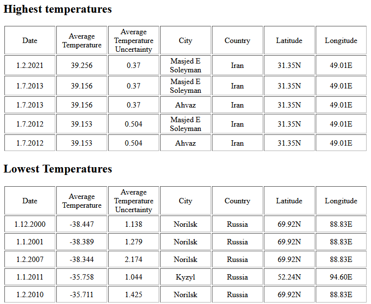

# Temperature Analysis

## Requirements
- A working Docker installation

## Starting application
1. Setup database `docker run --name temperaturedb -p 3306:3306 -e MYSQL_ROOT_PASSWORD=1234 -d mariadb/server:10.4`
2. Run app/src/db/schema.sql on database to setup schema, create user and load data.
3. Run `docker-compose up -d`

## Design Decisions
- MariaDB as a nice database with a clean available docker image
- I chose to program with Flask, as I already had experiences with it. Also,
a full fledged REST API with Django would have been way too much for such a 
  short programming exercise. The disadvantage of Flask is of course that you have
  to have a very nice structure such that maintainability is still given.

## Experiments
All experiments were performed using the frontend available at localhost:5000.

 1. The row with the highest temperature since 2000 is `1.7.2013 	39.156 	0.37 	Masjed E Soleyman 	Iran 	31.35N 	49.01E`
 2. 
 3. The result of the final task is `1.2.2021 	39.006 	0.37 	Masjed E Soleyman 	Iran 	31.35N 	49.01E`

## Total Developemnt Time
The project was finished in about 5 hours.